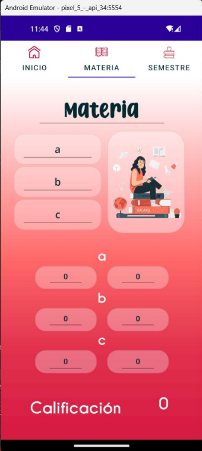
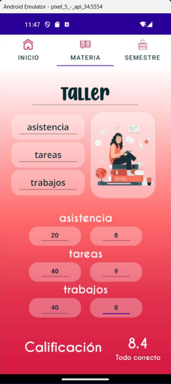
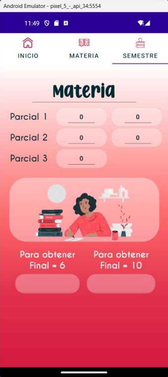

# calculadora_calificaciones
Desarrollo de una aplicación móvil utilizando .NET Multi-platform App UI (.NET MAUI).

## FUNCIONALIDAD
La aplicación debe contar con las siguientes especificaciones:
* Usar el patrón de diseño MVVM.
* Navegación entre páginas utilizando TabbedPage.

## VISTA
La aplicación tendrá tres páginas, cada una deberá tener al menos una imagen y una fuente externa.

### INICIO 
Página de portada con diseño libre, donde se utilicen imágenes, fuentes externas y un fondo degradado.

    

### MATERIA 
Página para calcular la calificación de una materia, siguiendo las siguientes especificaciones:
* Solicitar el nombre de la materia.
* Solicitar tres rubros a calificar, como por ejemplo: asistencia, tareas, examen.
* Solicitar el valor para cada rubro, validando que los números ingresados sean del 1 al 100, además de que la suma de estos sea igual a 100.
* Solicitar la calificación para cada rubro, validando que los números ingresados sean del 1 al 10.
* Mostrar al usuario la calificación final de la materia, validando que esta se encuentre en un rango entre 1 y 10.

    

##### Ejemplo de uso:

    

  
### SEMESTRE
Página para calcular la calificación del semestre de una materia, con los siguientes requerimientos:
* Solicitar el nombre de la materia.
* Solicitar el valor para cada parcial, considerando tres parciales y verificando que los números ingresados sean del 1 al 100, además de que la suma de estos sea igual a 100.
* Solicitar la calificación para los dos primeros parciales, verificando que los números ingresados sean del 1 al 10.
* Mostrar al usuario la calificación que necesita para sacar 6 y la que necesita para sacar 10.
* Si todavía puede sacar 10, mostrar un mensaje de aliento; de lo contrario, mostrar un mensaje de consolación.

    

##### Ejemplo de uso:

    

